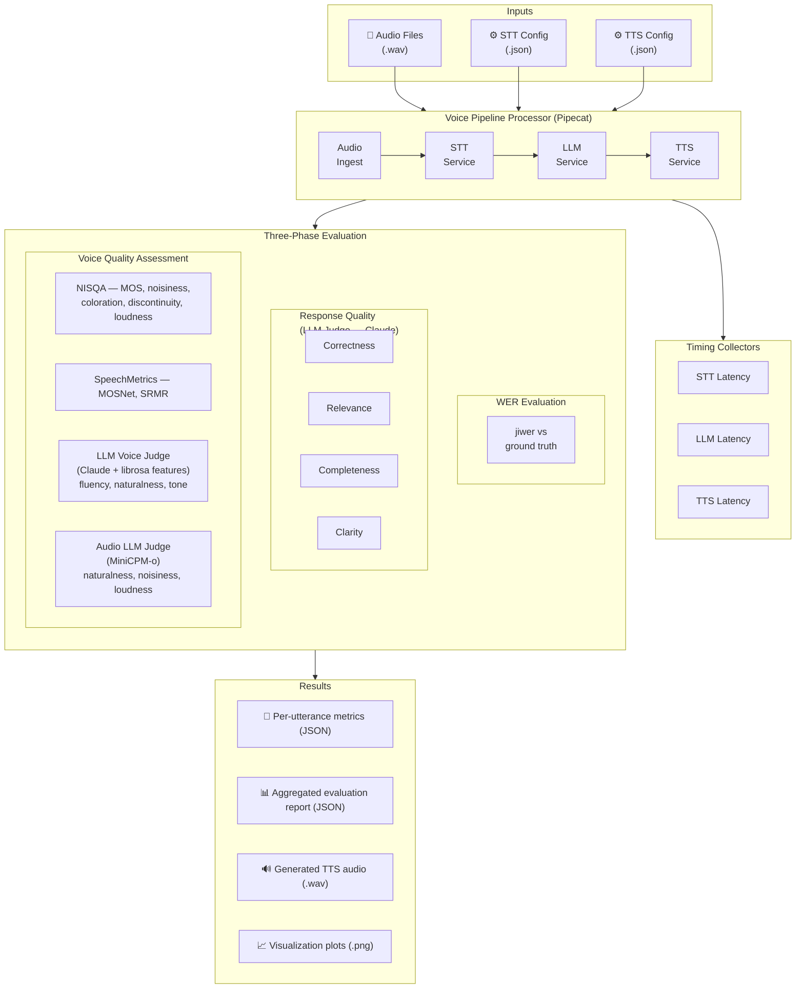

# Voice Assistant Evaluation Pipeline

A comprehensive evaluation framework for voice assistants that measures speech-to-text accuracy, response quality, voice quality, and latency metrics across different AI service combinations on the [Pipecat](https://github.com/pipecat-ai/pipecat) platform.

## Overview

This project provides a complete pipeline for evaluating voice assistants with multiple AI service providers. It enables systematic comparison of different STT/TTS/LLM combinations to find the best trade-offs between accuracy, latency, and voice quality.

## Architecture



### Supported Services

| STT (Speech-to-Text)     | TTS (Text-to-Speech)     | LLM                              |
|--------------------------|--------------------------|----------------------------------|
| AWS Transcribe           | AWS Polly                | Amazon Bedrock (Claude Haiku)    |
| Deepgram Nova-2          | Cartesia                 | Groq                             |
| Deepgram Nova-3          | Deepgram Aura            | OpenAI                           |
| Whisper (small/large/turbo) | ElevenLabs            |                                  |
| NVIDIA Riva (Parakeet)   | Groq                     |                                  |
| AssemblyAI               | LMNT                     |                                  |
| Gladia                   | NVIDIA Riva (Magpie)     |                                  |
|                          | OpenAI TTS / TTS-HD      |                                  |
|                          | PlayHT                   |                                  |
|                          | Rime                     |                                  |

### Core Frameworks

- **[Pipecat](https://github.com/pipecat-ai/pipecat)** — Voice agent orchestration and real-time audio processing
- **[Strands Agents](https://github.com/strands-agents/sdk-python)** — Multi-agent conversation management and tool calling

## Project Structure

```
├── src/
│   ├── core/                              # Voice bot under test
│   │   ├── voice_bot.py                   # Main bot implementation
│   │   ├── agent_builder.py               # Strands agent configuration
│   │   ├── llm_processor.py               # LLM integration
│   │   ├── tts.py                         # TTS service implementations
│   │   └── nvidia/                        # NVIDIA Riva/NeMo adapters
│   └── evaluation/                        # Evaluation framework
│       ├── voice_pipeline_evaluator.py    # Entry point: run pipeline
│       ├── metrics_calculator.py          # Entry point: score results
│       ├── models.py                      # Pydantic data models
│       ├── config/                        # Configuration management
│       ├── factories/                     # Service factory pattern
│       ├── pipeline/                      # Pipeline build & execution
│       ├── orchestration/                 # Evaluation workflow
│       ├── results/                       # Result collection & I/O
│       ├── services/                      # LLM service, Whisper STT
│       └── metrics/                       # Quality evaluators
│           ├── wer_evaluator.py           #   Word Error Rate
│           ├── response_quality_evaluator.py  #   LLM-as-judge
│           ├── voice_quality_evaluator.py #   Audio quality
│           ├── nisqa_evaluator.py         #   NISQA MOS scoring
│           ├── speechmetrics_evaluator.py #   MOSNet, SRMR
│           └── voice_quality_judge.py     #   LLM audio judge
├── evaluation_data/
│   ├── datasets/                          # Eval datasets & audio (.wav)
│   ├── stt_configs/                       # STT service configs (.json)
│   ├── tts_configs/                       # TTS service configs (.json)
│   └── training_dataset/                  # Fine-tuning training data
├── scripts/                               # Evaluation runner scripts
│   ├── run_evaluation.sh                  # Unified runner (recommended)
│   └── test_<stt>_<tts>.sh               # Per-combination scripts
├── audio_quality_scoring/                 # Audio labeling & fine-tuning
├── visualize/                             # Result visualization
├── tests/                                 # Unit & integration tests
├── requirements.txt
└── .env.example
```

## Quick Start

### Prerequisites

- Python 3.8+
- ffmpeg
- AWS account with Transcribe/Polly access
- API keys for desired AI services (see `.env.example`)

### Setup

```bash
# Environment
cp .env.example .env
# Edit .env with your API keys

# Dependencies
sudo apt-get update && sudo apt-get install -y ffmpeg
python -m venv venv && source venv/bin/activate
pip install -r requirements.txt

# Fix numpy compatibility
./scripts/fix_srmrpy.sh

# Download Whisper models (if using local STT)
python -c "import whisper; whisper.load_model('turbo')"
```

## Running Evaluations

### Unified Runner (recommended)

```bash
./scripts/run_evaluation.sh <stt_config> <tts_config>
```

Examples:

```bash
./scripts/run_evaluation.sh aws_transcribe cartesia
./scripts/run_evaluation.sh deepgram_nova3 aws_polly
./scripts/run_evaluation.sh whisper_turbo groq
```

Run without arguments to see available configs:

```bash
./scripts/run_evaluation.sh
```

### Per-Combination Scripts

```bash
./scripts/test_aws_transcribe_polly.sh
./scripts/test_deepgram_nova3_cartesia.sh
./scripts/test_whisper_turbo_groq.sh
```

### What Happens

Each evaluation runs two steps:

1. **Pipeline execution** (`voice_pipeline_evaluator.py`) — Sends audio through the STT → LLM → TTS pipeline, records transcriptions, responses, generated audio, and latency timings.

2. **Scoring** (`metrics_calculator.py`) — Evaluates the results:
   - **WER**: Compares STT output against ground truth transcriptions
   - **Response quality**: LLM-as-judge scores (correctness, relevance, completeness, clarity)
   - **Voice quality**: NISQA MOS, MOSNet, SRMR, and LLM audio quality assessment

### NVIDIA Services

See [src/core/nvidia/README.md](src/core/nvidia/README.md) for NVIDIA Riva setup.

## Evaluation Metrics

| Category              | Metric                  | Method                                    |
|-----------------------|-------------------------|-------------------------------------------|
| **STT Accuracy**      | Word Error Rate (WER)   | jiwer vs ground truth                     |
| **Response Quality**  | Correctness (0–10)      | LLM-as-judge (Claude)                     |
|                       | Relevance (0–10)        | LLM-as-judge (Claude)                     |
|                       | Completeness (0–10)     | LLM-as-judge (Claude)                     |
|                       | Clarity (0–10)          | LLM-as-judge (Claude)                     |
| **Voice Quality**     | MOS (1–5)               | NISQA neural model                        |
|                       | Noisiness (1–5)         | NISQA sub-dimension                       |
|                       | Coloration (1–5)        | NISQA sub-dimension                       |
|                       | Discontinuity (1–5)     | NISQA sub-dimension                       |
|                       | Loudness (1–5)          | NISQA sub-dimension                       |
|                       | MOSNet (1–5)            | SpeechMetrics                             |
|                       | SRMR (dB)               | SpeechMetrics                             |
|                       | Fluency (0–10)          | LLM voice judge (Claude + librosa)        |
|                       | Naturalness (0–10)      | LLM voice judge (Claude + librosa)        |
|                       | Tone (0–10)             | LLM voice judge (Claude + librosa)        |
|                       | Overall (0–10)          | LLM voice judge (Claude + librosa)        |
|                       | Naturalness (1–10)      | Audio LLM judge (MiniCPM-o)               |
|                       | Noisiness (1–10)        | Audio LLM judge (MiniCPM-o)               |
|                       | Loudness (1–10)         | Audio LLM judge (MiniCPM-o)               |
| **Latency**           | STT latency (ms)        | Time to transcription                     |
|                       | TTS latency (ms)        | Time to first audio                       |
|                       | Total latency (ms)      | End-to-end pipeline time                  |

## Output

Results are saved in `evaluation_output/` (gitignored):

```
evaluation_output/
├── <stt>_<tts>_results.json        # Per-utterance pipeline results
├── <stt>_<tts>_evaluation.json     # Aggregated metrics & scores
└── tts_audio/
    └── <stt>_<tts>/                # Generated TTS audio per combination
        ├── question_0_response.wav
        └── ...
```

Generate plots from results:

```bash
python visualize/plot_evaluation_results.py
```

## Adding New Services

1. Add API key to `.env`
2. Create a config JSON in `evaluation_data/stt_configs/` or `evaluation_data/tts_configs/`:

```json
{
  "stt_service_id": "my_new_stt",
  "stt_service_name": "My New STT",
  "module": "pipecat.services.my_stt",
  "class": "MySTTService",
  "params": { ... }
}
```

3. Run: `./scripts/run_evaluation.sh my_new_stt cartesia`

## Running Tests

```bash
pytest tests/
```

## Troubleshooting

| Problem                | Solution                                                    |
|------------------------|-------------------------------------------------------------|
| Evaluation won't start | Check API keys in `.env`, run `pip install -r requirements.txt` |
| Poor STT accuracy      | Verify audio is 16kHz mono; try different STT providers     |
| High latency           | Check network; use regional endpoints (`AWS_REGION`)        |
| NISQA errors           | Ensure ffmpeg is installed; check audio file format         |

## License

[Add your license information]

## Contributing

[Add contribution guidelines]
