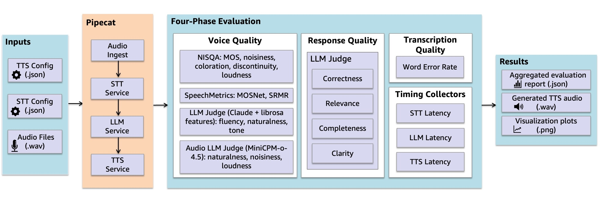
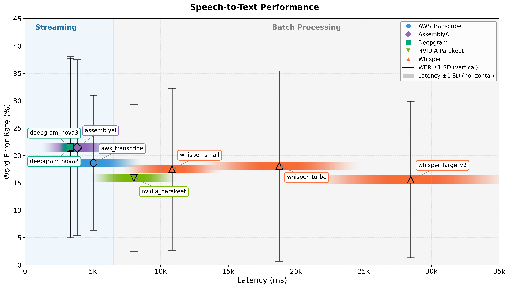
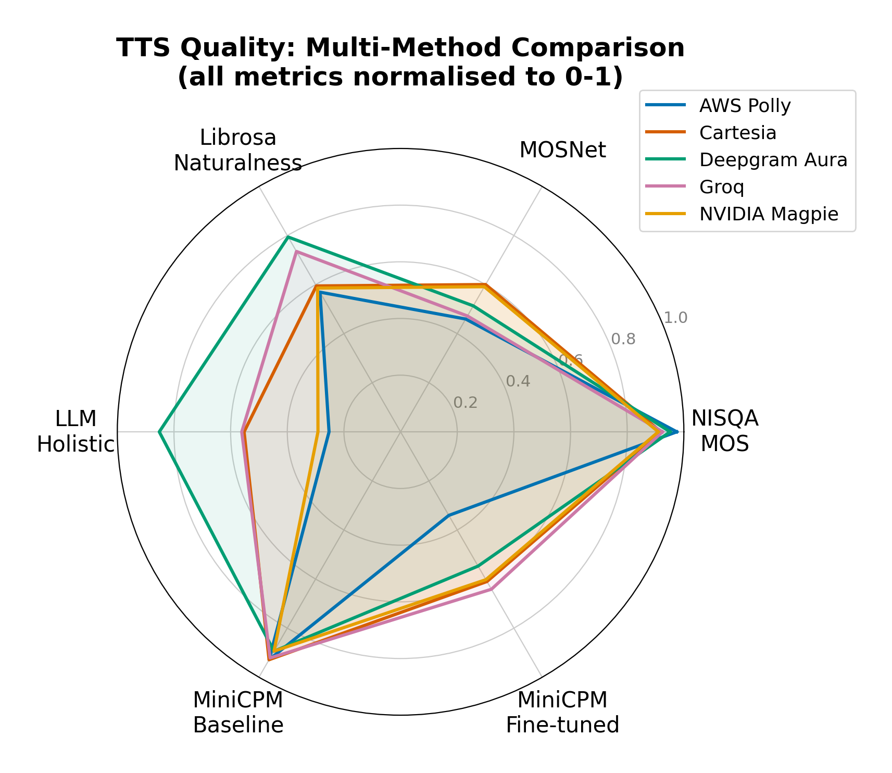

# Voice Assistant Evaluation Pipeline

A comprehensive evaluation framework for voice assistants that measures speech-to-text accuracy, response quality, and latency metrics across different AI service combinations.

## Overview

This project provides a complete pipeline for building, testing, and evaluating voice assistants with multiple AI service providers. It enables systematic comparison of different STT/TTS/LLM combinations to optimize for accuracy, latency, and voice quality.



**Implementation Pipeline:** Overview of the voice pipeline evaluation framework. Audio inputs and configuration files are processed through a Pipecat-based pipeline (STT, LLM, TTS), followed by a four-phase evaluation comprising voice quality assessment (NISQA, SpeechMetrics, LLM Voice Judge, Audio LLM Judge), response quality scoring (correctness, relevance, completeness, clarity), transcription quality via Word Error Rate, and end-to-end latency measurement across each pipeline stage.

## Architecture

### Core Frameworks
- **Pipecat** - Voice agent orchestration and real-time audio processing
- **Strands Agents** - Multi-agent conversation management and tool calling
- **FastAPI** - Backend API server with WebSocket support

### AI Services
- **Speech-to-Text (STT)**: AWS Transcribe, Deepgram Nova-3, Speechmatics, AssemblyAI, Gladia
- **Text-to-Speech (TTS)**: AWS Polly, Deepgram Aura-2, ElevenLabs, Cartesia, PlayHT, LMNT, Rime
- **Large Language Models (LLM)**: Amazon Bedrock (Claude 3.5 Haiku), OpenAI, Groq

## Quick Start

### Prerequisites
- Python 3.8+
- ffmpeg (required for audio quality metrics)
- AWS account with Transcribe/Polly access
- API keys for desired AI services (see `.env.example`)

### 1. Environment Setup

```bash
# Copy environment template
cp .env.example .env

# Edit .env and add your API keys
nano .env
```

Required keys:
- `AWS_ACCESS_KEY_ID`, `AWS_SECRET_ACCESS_KEY`, `AWS_REGION` - For AWS services
- `DEEPGRAM_API_KEY` - For Deepgram STT/TTS (optional)
- `OPENAI_API_KEY` - For OpenAI services (optional)
- `GROQ_API_KEY` - For Groq LLM services (optional)
- `CARTESIA_API_KEY` - For Cartesia TTS (optional)
- Additional keys for other providers (optional)

### 2. Setup

```bash
# Install system dependencies
sudo apt-get update
sudo apt-get install -y ffmpeg

# Create virtual environment (recommended)
python -m venv .venv
source .venv/bin/activate

# Install dependencies
pip install -r requirements.txt

# Fix numpy compatibility in srmrpy
chmod +x ./scripts/fix_srmrpy.sh
./scripts/fix_srmrpy.sh

# Download Whisper models (required for local STT)
python -c "import whisper; whisper.load_model('turbo'); whisper.load_model('large'); whisper.load_model('small')"
```

## Evaluation

### Running Evaluations

Evaluate AWS Transcribe + Polly pipeline:
```bash
./scripts/test_aws_transcribe_polly.sh
```

### NVIDIA Services

For NVIDIA AI services setup and deployment instructions, see [src/core/nvidia/README.md](src/core/nvidia/README.md).

### Evaluation Metrics

The framework measures:

**Speech Recognition Accuracy**
- Word Error Rate (WER)
- Character Error Rate (CER)
- Transcription confidence scores



**STT Latency vs WER:** Comparison of transcription speed across evaluated STT models. (Left) shows the comparison of streaming models where DeepGram Nova 3 had the lowest latency of 3,342±836ms. (Right) shows the comparison of batch models where Whisper Large had the highest latency of 28,463±7,797ms.

**Response Quality** (LLM-as-judge scoring)
- Correctness - Factual accuracy
- Relevance - Alignment with user intent
- Completeness - Coverage of required information
- Clarity - Communication effectiveness

**Performance Metrics**
- STT latency (time to first word, total transcription time)
- LLM processing time
- TTS generation latency
- End-to-end response time

**Voice Quality**
- Audio clarity and naturalness
- Prosody and intonation
- Speech rate and rhythm



**TTS Quality Across Evaluation Methods:** Normalised to a 0–1 scale. NISQA MOS clusters all providers between 0.90–0.95, while LLM Holistic and Librosa Naturalness show the widest spread across providers.

### Full Composite Ranking

Composite ranking of STT×TTS service combinations across accuracy, latency, and voice quality metrics. Scores are weighted averages of min-max normalized values (higher is better). Weights: WER 30%, Latency 30%, LLM Judge 10%, Voice LLM 10%, MiniCPM metrics 20%.

| Rk | STT | TTS | Score | WER% | Judge | TotLat | VcLLM | mcNat | mcNoi | mcLod | STTms | TTSms |
|----|-----|-----|-------|------|-------|--------|-------|-------|-------|-------|-------|-------|
| 1 | nvidia_parakeet | cartesia | 0.802 | 15.9 | 8.70 | 20584 | 3.20 | 9.1 | 1.67 | 6.86 | 8092 | 433 |
| 2 | nvidia_parakeet | deepgram_aura | 0.771 | 15.9 | 8.70 | 26817 | 4.38 | 9.0 | 4.97 | 7.00 | 7964 | 779 |
| 3 | nvidia_parakeet | groq | 0.751 | 15.9 | 8.71 | 27635 | 3.30 | 9.0 | 1.95 | 6.88 | 8014 | 1716 |
| 4 | whisper_small | cartesia | 0.733 | 17.6 | 8.68 | 22528 | 3.24 | 9.1 | 1.66 | 6.83 | 10108 | 432 |
| 5 | whisper_small | deepgram_aura | 0.729 | 17.7 | 8.68 | 25739 | 4.39 | 9.0 | 4.93 | 7.00 | 11180 | 732 |
| 6 | whisper_small | groq | 0.714 | 17.7 | 8.73 | 26708 | 3.26 | 9.0 | 1.95 | 6.88 | 11076 | 1770 |
| 7 | aws_transcribe | deepgram_aura | 0.710 | 18.6 | 8.61 | 23000 | 4.41 | 9.0 | 4.95 | 7.00 | 5009 | 411 |
| 8 | aws_transcribe | cartesia | 0.709 | 19.1 | 8.46 | 17530 | 3.18 | 9.1 | 1.68 | 6.90 | 5197 | 485 |
| 9 | whisper_turbo | deepgram_aura | 0.688 | 18.1 | 8.80 | 34398 | 4.39 | 9.0 | 4.95 | 7.00 | 18705 | 775 |
| 10 | aws_transcribe | groq | 0.686 | 18.8 | 8.56 | 20573 | 3.22 | 9.0 | 1.96 | 6.88 | 5008 | 1655 |
| 11 | aws_transcribe | nvidia_magpie | 0.682 | 18.6 | 8.55 | 13491 | 2.17 | 9.8 | 4.69 | 6.87 | 5034 | 899 |
| 12 | whisper_large | deepgram_aura | 0.671 | 16.3 | 8.72 | 41813 | 4.47 | 9.0 | 4.99 | 7.00 | 28167 | 761 |
| 13 | aws_transcribe | aws_polly | 0.662 | 18.6 | 8.62 | 12472 | 2.02 | 8.0 | 1.03 | 6.73 | 5024 | 302 |
| 14 | deepgram_nova3 | cartesia | 0.649 | 21.5 | 8.59 | 19840 | 3.19 | 9.1 | 1.70 | 6.89 | 3338 | 450 |
| 15 | whisper_turbo | groq | 0.640 | 18.4 | 8.74 | 35785 | 3.24 | 9.0 | 1.96 | 6.88 | 19510 | 1677 |
| 16 | whisper_large | groq | 0.637 | 16.2 | 8.73 | 43398 | 3.23 | 9.0 | 1.93 | 6.86 | 28533 | 2008 |
| 17 | deepgram_nova2 | cartesia | 0.626 | 21.5 | 8.56 | 22362 | 3.22 | 9.1 | 1.75 | 6.88 | 3346 | 662 |
| 18 | nvidia_parakeet | nvidia_magpie | 0.625 | 15.9 | 8.74 | 38672 | 2.15 | 9.8 | 4.66 | 6.86 | 8042 | 793 |
| 19 | whisper_turbo | cartesia | 0.614 | 19.6 | 8.50 | 27697 | 3.22 | 9.0 | 1.69 | 6.86 | 17521 | 426 |
| 20 | deepgram_nova3 | deepgram_aura | 0.609 | 21.5 | 8.57 | 25697 | 4.41 | 9.0 | 4.92 | 7.00 | 3329 | 399 |
| 21 | deepgram_nova2 | deepgram_aura | 0.599 | 21.4 | 8.52 | 25527 | 4.40 | 9.0 | 4.95 | 7.00 | 3391 | 403 |
| 22 | assemblyai | deepgram_aura | 0.594 | 22.1 | 8.55 | 25075 | 4.42 | 9.0 | 4.94 | 7.00 | 4280 | 409 |
| 23 | nvidia_parakeet | aws_polly | 0.579 | 15.9 | 8.69 | 38669 | 2.01 | 8.1 | 1.06 | 6.78 | 8052 | 261 |
| 24 | deepgram_nova2 | groq | 0.579 | 21.5 | 8.58 | 26072 | 3.23 | 9.0 | 1.95 | 6.86 | 3325 | 1429 |
| 25 | assemblyai | groq | 0.574 | 22.0 | 8.56 | 25470 | 3.23 | 9.0 | 1.96 | 6.88 | 4181 | 1523 |
| 26 | deepgram_nova3 | groq | 0.568 | 21.7 | 8.58 | 26426 | 3.23 | 9.0 | 1.98 | 6.86 | 3352 | 1524 |
| 27 | whisper_small | nvidia_magpie | 0.556 | 17.6 | 8.66 | 40985 | 2.12 | 9.8 | 4.62 | 6.87 | 10935 | 778 |
| 28 | assemblyai | cartesia | 0.544 | 22.8 | 8.26 | 22310 | 3.20 | 9.1 | 1.63 | 6.89 | 3945 | 450 |
| 29 | whisper_small | aws_polly | 0.531 | 17.5 | 8.70 | 41021 | 2.01 | 8.0 | 1.03 | 6.82 | 10969 | 278 |
| 30 | assemblyai | nvidia_magpie | 0.505 | 18.3 | 8.47 | 41755 | 2.21 | 9.9 | 4.70 | 6.89 | 2487 | 815 |
| 31 | whisper_large | nvidia_magpie | 0.504 | 16.1 | 8.74 | 58237 | 2.17 | 9.9 | 4.63 | 6.88 | 28224 | 754 |
| 32 | whisper_turbo | nvidia_magpie | 0.504 | 18.0 | 8.76 | 49661 | 2.14 | 9.8 | 4.66 | 6.86 | 19567 | 802 |
| 33 | whisper_large | cartesia | 0.464 | 21.9 | 8.12 | 38066 | 3.22 | 9.1 | 1.67 | 6.88 | 28000 | 447 |
| 34 | whisper_turbo | aws_polly | 0.461 | 18.3 | 8.73 | 48580 | 2.01 | 7.9 | 1.02 | 6.80 | 18466 | 271 |
| 35 | whisper_large | aws_polly | 0.459 | 16.2 | 8.79 | 59349 | 2.01 | 7.9 | 1.06 | 6.80 | 29356 | 279 |
| 36 | deepgram_nova2 | nvidia_magpie | 0.436 | 21.3 | 8.55 | 42287 | 2.17 | 9.8 | 4.63 | 6.89 | 3395 | 835 |
| 37 | deepgram_nova3 | nvidia_magpie | 0.429 | 21.2 | 8.53 | 42257 | 2.21 | 9.8 | 4.65 | 6.87 | 3353 | 832 |
| 38 | deepgram_nova2 | aws_polly | 0.406 | 21.4 | 8.60 | 42278 | 2.02 | 7.9 | 1.04 | 6.83 | 3350 | 269 |
| 39 | deepgram_nova3 | aws_polly | 0.387 | 21.6 | 8.57 | 42254 | 2.00 | 7.8 | 1.04 | 6.81 | 3336 | 263 |
| 40 | assemblyai | aws_polly | 0.349 | 22.9 | 8.47 | 42402 | 2.01 | 7.8 | 1.03 | 6.85 | 4320 | 278 |

### Output

Results are saved in `output/` (gitignored due to size):
- `eval-results/` - Full evaluation run data
- `scoring_output/` - Audio quality scoring results
- `plots/` - Generated charts and visualizations
- `tts_audio/` - Generated audio files for quality review
- `*_results.json` / `*_evaluation.json` - Per-experiment metrics

> **Pre-computed results:** Evaluation results and generated TTS audio samples are available on Hugging Face:
> [MahsaPak/voice-ai-stack-evaluation](https://huggingface.co/datasets/MahsaPak/voice-ai-stack-evaluation)

## Development

### Core Components

**Voice Bot Core**
- `src/core/voice_bot.py` - Bot orchestration and pipeline management
- `src/core/agent_builder.py` - Strands agent configuration
- `src/core/llm_processor.py` - LLM integration and prompt management

**Evaluation Pipeline Architecture**
- `src/evaluation/voice_pipeline_evaluator.py` - Main evaluation entry point and runner
- `src/evaluation/config/configuration_manager.py` - Configuration loading and management
- `src/evaluation/factories/` - Service factory pattern for STT/TTS creation
- `src/evaluation/pipeline/` - Pipeline construction, execution, and audio processing
- `src/evaluation/services/service_manager.py` - Service lifecycle management
- `src/evaluation/results/results_collector.py` - Result collection and file operations
- `src/evaluation/orchestration/evaluation_orchestrator.py` - Evaluation workflow orchestration
- `src/evaluation/models.py` - Pydantic data models for type safety
- `src/evaluation/metrics_calculator.py` - Metric computation
- `src/evaluation/audio_quality_analyzer.py` - Voice quality assessment

### Adding New AI Services

1. Add API key to `.env`
2. Update service configuration in `src/core/voice_bot.py`
3. Create evaluation config in `data/`
4. Add evaluation script in `scripts/`

### Running Tests

```bash
pytest tests/
```

### Agent Configuration

Modify `src/core/agent_builder.py` to customize:
- System prompts
- Tool definitions
- Conversation flow
- Context management

## Troubleshooting

**Poor STT accuracy**
- Verify audio quality (16kHz, mono recommended)
- Check microphone permissions
- Try different STT providers

**High latency**
- Check network connectivity
- Consider regional endpoints (set `AWS_REGION`)
- Use streaming STT/TTS services
